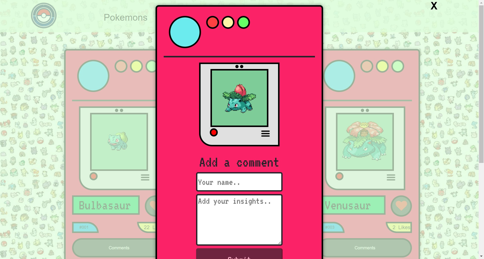

# Pokémon World

The website allow Pokemon lovers to look for the Pokemon cards by name, see all cards in series, gamer can add new decks and store cards in them. Gamer can see and do like and comments on the card, for comments there is extra overlay features which pops up by clicking on comment button, where gamer can comment and see other comments about the particular card.

## Built With

- HTML & CSS
- JavaScript

## LiveDemo
[Pokemon-World]()
## ScreenShot Demo

👤 **Monika**

- GitHub: [GitHub](https://github.com/monikasoambyjus)
- Twitter: @monikasoam

🤝 **Contributing**

Contributions, issues, and feature requests are welcome!

Feel free to check the [issues page](https://github.com/monikasoambyjus/Pokemon/issues).

## Show your support

Give a ⭐️ if you like this project! and advice me where to work upon it